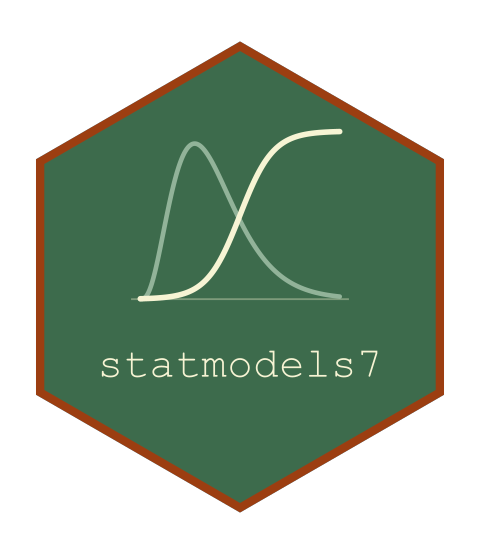

<!-- README.md is generated from README.Rmd. Please edit that file, then
     regenerate with devtools::build_readme(). Do not use knitr::knit(): it
     processes the code but leaves this YAML header in the output as literal
     text, which GitHub and pkgdown both render verbatim. -->

<!-- badges: start -->
[](https://github.com/statmodels7/statmodels7/actions/workflows/R-CMD-check.yaml)
[](https://app.codecov.io/gh/statmodels7/statmodels7)
[](https://lifecycle.r-lib.org/articles/stages.html#experimental)
<!-- badges: end -->

```{r, include = FALSE}
knitr::opts_chunk$set(
  collapse = TRUE,
  comment = "#>"
)
```

# statmodels7 

`{statmodels7}` installs and attaches the packages of the
[statmodels7](https://statmodels7.github.io) toolkit, an S7 framework for
statistical modelling. Installing this package installs all of them, and
attaching it attaches all of them.

## Installation

```r
# install.packages("pak")
pak::pak("statmodels7/statmodels7")
```

Attaching it attaches the members, and says which arrived at which version.

```{r}
library(statmodels7)
```

To install or update every member afterwards:

```r
statmodels7_update("install")
```

## What the toolkit is

Almost every R modelling package carries its own distributions and link
functions, written as internal helpers: a `switch` on a character string,
closures private to the package that owns them. They are not objects, so
nothing outside can reuse them, extend them, or ask them for anything their
author did not happen to need — and since each package writes only what it
needs, that is usually the density and the score, sometimes the Hessian, and
nothing beyond.

A Gamma is a fixed mathematical object. It should be written once, correctly,
with everything a modelling routine could want already computed, and then
everyone builds on top. The same argument applies to an optimiser, whose
stopping rule decides what a run means by *finished* and is usually a number
buried three levels down inside the function that needs it.

```{r}
statmodels7_packages()
```

| package | what it provides |
|---|---|
| [linkfunctions7](https://statmodels7.github.io/linkfunctions7/) | link functions as objects, with exact derivatives to fourth order in both directions |
| [distributions7](https://statmodels7.github.io/distributions7/) | univariate and multivariate distributions with exact score, information and higher derivatives |
| [optimizers7](https://statmodels7.github.io/optimizers7/) | optimisation algorithms as objects, with composable stopping rules |
| [basis7](https://statmodels7.github.io/basis7/) | basis expansions with derivatives, anchored integrals and exact Gram matrices |
| [parameters7](https://statmodels7.github.io/parameters7/) | constrained parameters as maps from an unconstrained vector, exact to fourth order |

## What this package does

Four functions, and an attach hook.

```{r}
statmodels7_versions()
```

```{r}
statmodels7_conflicts()
```

The members sit in `Imports` rather than `Depends`, which is what lets the
attaching be reported rather than merely happen: `Depends` would attach them
in the order the field lists them, with no message and no way for a caller to
see what arrived at which version.

## Related

The mathematical companion to the whole toolkit is the
[book](https://statmodels7.github.io/book/), which gives every formula the
packages implement with its derivation and its citation.
